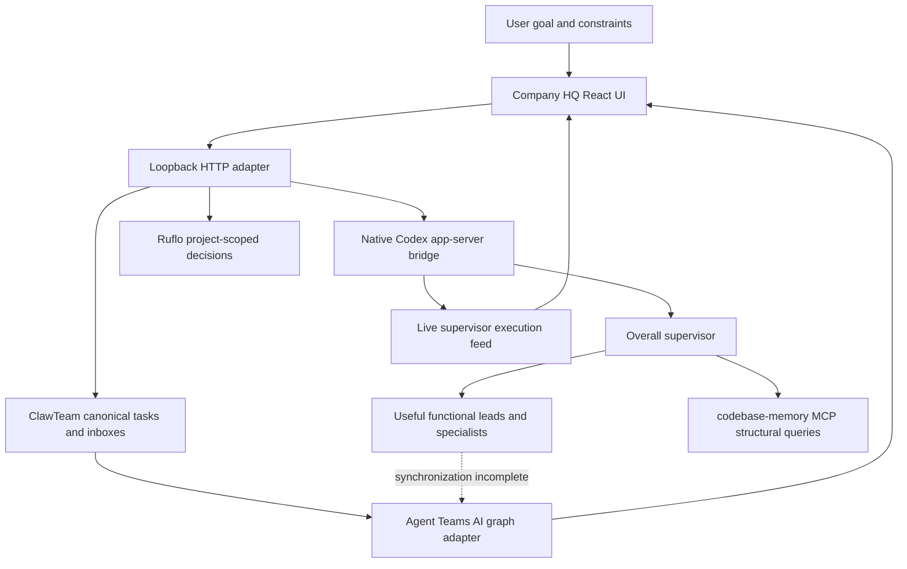

# Architecture

`company-hq/src/App.tsx` owns the current shell and form flows; it needs decomposition into stable components and a typed API boundary. `TeamGraph.tsx` adapts records to the upstream graph port. The sole modified upstream graph source caps automatic camera-fit zoom; manual zoom remains available.

`secure_board.py` applies loopback and same-origin checks and serves the app. `hq_api.py` joins existing ClawTeam, scoped Ruflo and native bridge operations. `codex_bridge.py` owns native process/RPC/session state, project binding, approvals and events. Keep one runtime authority; use the other frameworks for useful components rather than stacking autonomous schedulers.

Memory decisions are scoped by canonical project path. Task metadata is not a worker process; inbox delivery is not a wake acknowledgement. Tokens reported by a provider are distinct from account-wide allowance and actual billed money.

Source/configuration, per-project runtime state, account credentials and product files must remain separate. See the first handoff milestone for removing the remaining original-machine paths.

## Automatic routing

Build requests now pass through the deterministic classifier and independent preflight review design before execution. See [Automatic routing and review](AUTOMATIC-ROUTING.md) for the full classification → review → staffing → execution → verification → completion-review pipeline, model tiers, and current upstream component decisions.
