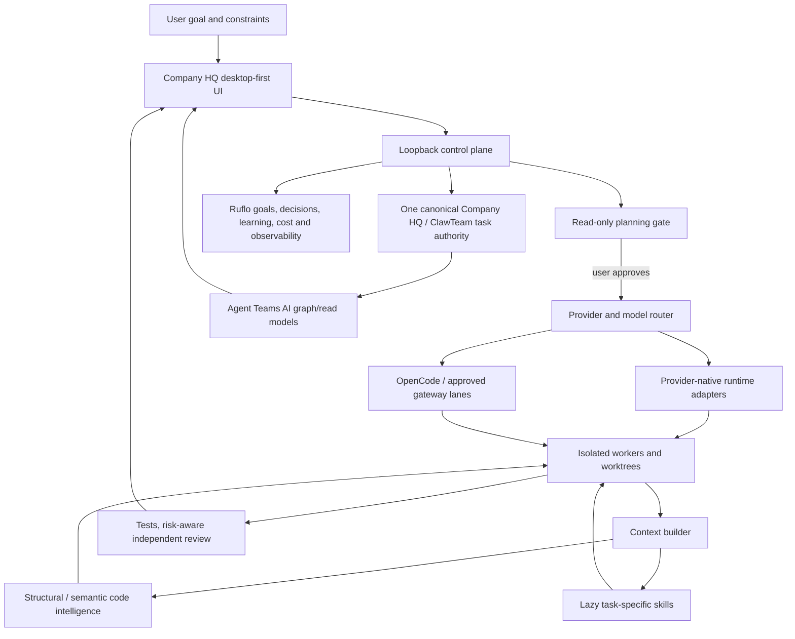

# Architecture

## Authority boundaries

Company HQ owns the user workflow, task identity, project binding, provider choice,
execution approval and merge candidate. Other frameworks contribute components;
they do not start a second autonomous company beside it.

The first provider-backed turn is **read-only planning**. Native Codex currently
implements this with the app-server `readOnly` sandbox policy. A separate user
action changes the session to workspace-write execution. Normal command/file
permission requests remain separate from the plan approval.

Provider authentication remains with the supported provider runtime whenever
possible. A coding-plan/API gateway is a separate lane and must never be
presented as native subscription usage.

## Best-of-repositories layers

The active selection policy is in [BEST-OF-STACK.md](BEST-OF-STACK.md). In
particular:

- current Agent Teams AI provider/runtime/usage patterns are preferred over
  rebuilding those surfaces from scratch;
- Ruflo is a major orchestration-intelligence/cost/memory subsystem, but not a
  competing task scheduler;
- structural code lookup happens before broad file exploration;
- RTK is the leading deterministic shell-output compression candidate;
- skills from large catalogs are loaded progressively, not concatenated into
  every prompt.

Graft and the guarded Codebase Memory MCP remain useful fallbacks while the
portable CodeGraph/Serena/Graphify paths are benchmarked and isolated.

## Current implementation seams

`company-hq/src/App.tsx` owns the current shell and plan/execute controls;
decomposition into typed UI features remains desirable. `TeamGraph.tsx`
adapts canonical task/team records to the Agent Teams AI graph port.

`secure_board.py` applies loopback and same-origin checks.
`hq_api.py` joins tasks, memory and runtime operations. `codex_bridge.py`
owns native Codex process/RPC/session state, project binding, plan/execution
mode, approvals and live events.

Memory is project-scoped. Task metadata is not proof of a running worker, inbox
storage is not a wake acknowledgement, and provider token counters are not the
same as account-wide allowance or a provider invoice.

Source/configuration, per-project runtime state, account credentials and product
files remain separate.